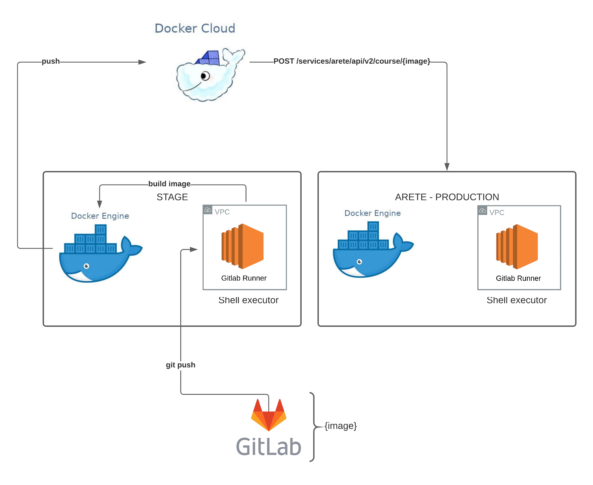

# Uva tester

Tester used to fetch student' results from [uHunt online judge API](https://uhunt.onlinejudge.org/api)

Here is a link to some higher level tutorial: https://github.com/envomp/Arete-runbook/blob/master/docs/SUB_TESTER_FOR_DEVELOPER.md

### Architecture diagram

